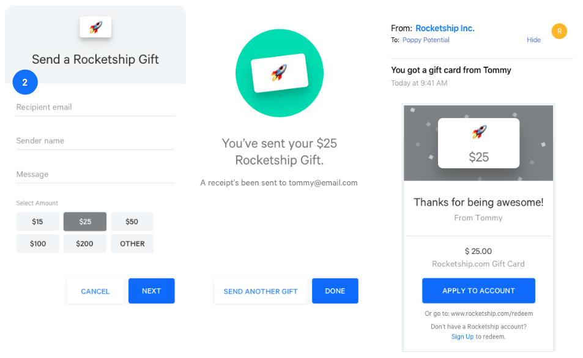
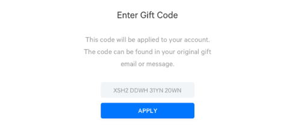

# Drop In Gift Cards
Lightrail's drop in gift card solution makes it easy to get up and running to sell gift cards from your site in days.

It is component based, using widgets which you add using simple HTML snippets.
Gift cards, when redeemed, are applied to the customer's account which can be used as a payment option during checkout. 

## Getting Started
[Sign up](https://www.lightrail.com/app/#/register) for a Lightrail account. 

Configure your drop in gift card [template](https://www.lightrail.com/app/#/cards/template) within your account. 
This sets the branding that is used in the widgets and gift card email. This is also where you'll connect your Stripe account and provide the URL to a redemption page where customers can redeem their gift cards (see Step 2).
 
Note this quickstart assumes you are using Stripe to process payments: if you are using another payment processor and want to build a custom solution, please contact us.

## Step 1: Selling Gift Cards
This allows your customers to purchase gift cards from your site. 
Lightrail has developed a widget that powers the entire gift card purchase and delivery flow. 


All you need to do is add a page with the following snippet:  
```html
<div>
    <script 
        src="https://embed.lightrail.com/dropIn/cardPurchase.js"
        data-shoppertoken="{shopperToken}"> 
    </script>
    <!-- The shopper token acts as a public api token that is used for issuing the gift card. -->
    <!-- See below for details.  -->
</div>
```
The gift card is automatically delivered in a branded email to the recipient.

## Step 2: Redeeming Gift Cards
This enables your customers to redeem gift cards to their account for later use.


The email includes a button to redeem the gift card. This link goes to your redemption page which is set in your drop in template.
This page should include the following snippet:
```html
<div class="redemption-widget">
    <script
        src="https://embed.lightrail.com/dropIn/codeRedemption.js"
        data-shoppertoken="{shopperToken}"
        data-fullcode="{giftCode}">
    </script>
     <!-- The gift code must be passed into the widget. Ideally passed automatically from the url. -->
</div>
``` 
The redemption widget applies the gift card to the customer's account in Lightrail, creating one if need be.  

Note, your redemption page must require the user to be signed in since you need to create a shopper token using a unique identifier for the customer from your system (see below).
This is how the redemption widget can automatically apply the gift card to their account.
 
Next, your existing checkout process needs to be modified allow the customer to pay with their account balance.

## Step 3: Checkout

### Display account balance
To start, use the following snippet to display a customer's account balance:
```html
<span>
    <script
        src="https://embed.lightrail.com/dropIn/accountBalance.js"
        data-shoppertoken="{shopperToken}">    
    </script>
</span>
```
This gives them the information to choose whether or not to apply their account credit to their purchase, or set a specific amount of account credit to use. In our [example app](https://github.com/Giftbit/stripe-integration-sample-webapp/blob/master/shared/views/checkout.html), the customer simply selects a checkbox to apply their account credit.

### Accept payment
Beyond that, you will need to add a script to your checkout page to handle the logic of setting the split point -- i.e. how much will be charged to the customer's account and how much will be covered by credit card -- and actually posting the charge.

You will likely want to customize this section. For an example, we recommend that you take a look at the [checkout page of our sample webapp](https://github.com/Giftbit/stripe-integration-sample-webapp/blob/master/shared/views/checkout.html#L62). This is a stripped-down example that loads a Stripe Elements form to handle the credit card portion of the payment if needed, and also handles the logic of splitting the transaction between the customer's account credit and Stripe. (Templating is done with Mustache.)

### Post the transaction (server side)
The transaction is handled by backend methods from one of our client libraries (or that you [write yourself](https://github.com/Giftbit/Lightrail-API-Docs/blob/drop-in-gift-cards/use-cases/stripe-split.md)). You'll need to set up an endpoint to handle the submission of the payment form from the previous step and redirect your customer to a success page, for example:

```javascript
/**
 * REST endpoint that performs the charge and returns HTML.
 */
function charge(req, res) {
    const splitTenderParams = {
        amount: req.body.orderTotal,      // From your cart/order object
        currency: req.body.currency,      // From your cart/order/store config
        source: req.body.source,          // Stripe payment 'source' or 'customer'
        shopperId: req.body.shopperId,    // Lightrail contact identifier; see below
        userSuppliedId: req.body.orderId       // Unique transaction identifier for idempotency
    };

    // Validate the amount to actually charge to Lightrail
    const lightrailShare = req.body.lightrailAmount;
    if (lightrailShare < 0) {
        res.status(400).send("Invalid value for Lightrail's share of the transaction");
    }

    // Use the Lightrail-Stripe integration library to create the split tender charge
    lightrailStripe.createSplitTenderCharge(splitTenderParams, lightrailShare, stripe)
        .then(splitTenderCharge => {
            // Redirect to your success page
            res.render("checkoutComplete.html", {
                lightrailTransactionValue: splitTenderCharge.lightrailTransaction ? splitTenderCharge.lightrailTransaction.value / -100 : 0,
                stripeChargeValue: splitTenderCharge.stripeCharge ? splitTenderCharge.stripeCharge.amount / 100 : 0
            });
        })
        .catch(err => {
            // You'll want to actually handle any errors that come back
            console.error("Error creating split tender transaction", err);
            res.status(500).send("Internal error");
        });
}
```

At this point, the charge has been posted to both Lightrail and Stripe. You can handle post-checkout flow as you otherwise would. 

## Authentication
You create your Lightrail API key from the [Integrations](https://www.lightrail.com/app/#/account/api) section of your Lightrail account.
Your Lightrail API key is used to generate shopper tokens which are passed into the widgets and to complete the server side requests from checkout.  

### Shopper Tokens
Shopper tokens act like customer-specific API tokens for use in the drop in widgets. 

You must generate them server side using one of our [client libraries](https://github.com/Giftbit/Lightrail-API-Docs/blob/docs/client-libraries.md). (If you are working in a language that we don't currently offer a client library for, please contact us to discuss creating your own tokens.) 

When creating a shopper token you must pass in the customer's ID from your system. This is what links the customer from your system to their account in Lightrail.  

You'll need an API key along your shared secret key from the Integrations section of your account (see above).
For example, using the Lightrail Javascript client the shopper token can be created as follows:
```javascript
lightrail.configure({
    apiKey: process.env.LIGHTRAIL_API_KEY,
    restRoot: "https://api.lightrail.com/v1/",
    logRequests: true,
    sharedSecret: process.env.LIGHTRAIL_SHARED_SECRET
});
lightrail.generateShopperToken({shopperId: "customer-id-from-your-system"})
```
Note, the redemption and account balance widgets must be on authenticated pages as they require a customer ID (the `shopperId`).
You may decide if you'd like your customers to be signed in to purchase gift cards. 
If you'd like to allow gift card purchase from an unauthenticated page simply generate a shopper token with `shopperId: ""`.

## Support
Looking for an example? Check out our [sample app](https://github.com/Giftbit/stripe-integration-sample-webapp) which is a working example of the entire drop in gift card solution.

Contact us any time at hello@lightrail.com —- we are here to help.
