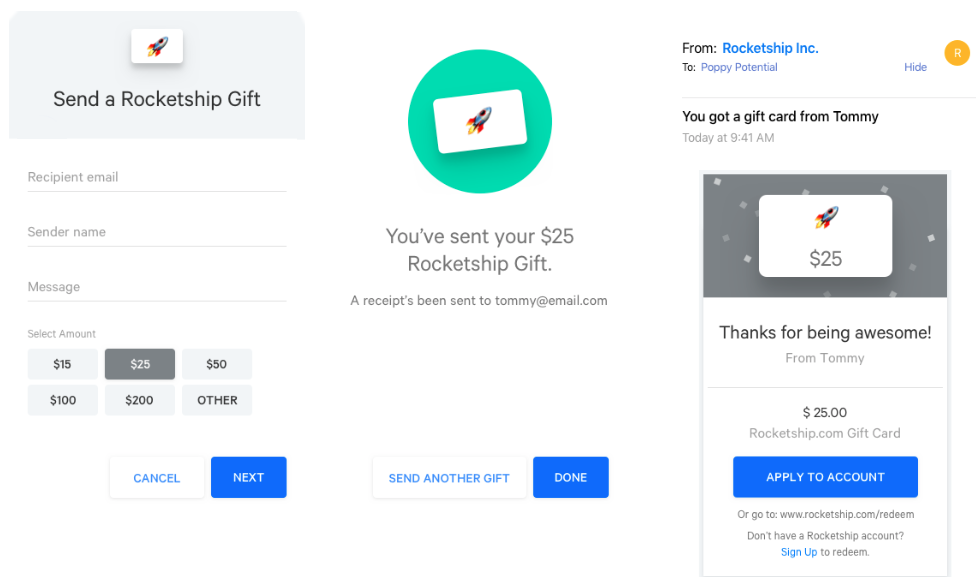

# Drop In Gift Cards
Lightrail's Drop-in Gift Card solution makes it easy to offer gift cards to your customers in days.

The solution is component based, using widgets which you add using simple HTML snippets.
Gift cards, when redeemed, are applied to the customer's account which can be used as a payment option during checkout. 

## Getting Started
[Sign up](https://www.lightrail.com/app/#/register) for a Lightrail account. 

Configure your Drop-in Gift Card [template](https://www.lightrail.com/app/#/cards/template) within your Lightrail account to customize the appearance of widgets and gift card emails. 

This is also where you'll connect your Stripe account and provide the URL to a redemption page where customers can redeem their gift cards (see Step 2).

Note this quickstart assumes you are using Stripe to process payments: if you are using another payment processor and want to build a custom solution, please [contact us](mailto:hello@lightrail.com).

## Step 1: Selling Gift Cards
The Gift Card Purchase Widget allows your customers to purchase gift cards from your site. 
Lightrail powers the entire gift card purchase and delivery flow. 


Add the following snippet to your site: 

```html
<div>
    <script 
        src="https://embed.lightrail.com/dropIn/cardPurchase.js"
        data-shoppertoken="{shopperToken}"> 
    </script>
    <!-- The shopper token acts as a public api token that is used for issuing the gift card. -->
    <!-- See below for details.  -->
</div>
```
The gift card is automatically delivered delivered to the recipient in a branded email. The email includes a button to redeem the gift card. 

## Step 2: Redeeming Gift Cards
The Gift Card Redemption Widget enables your customers to redeem gift cards to their account for later use.


When the customer clicks the button to redeem the gift card in the email, they are taken to the redemption page indicated in your Drop-In template.

The redemption page should include the following snippet:

```html
<div class="redemption-widget">
    <script
        src="https://embed.lightrail.com/dropIn/codeRedemption.js"
        data-shoppertoken="{shopperToken}"
        data-fullcode="{giftCode}">
    </script>
     <!-- The gift code must be passed into the widget. Ideally passed automatically from the url. -->
</div>
```
When a gift card is redeemed, the Redemption Widget applies the balance to the customer's account. If the customer does not have a customer account in Lightrail already, a new account will be created automatically.

The Redemption Widget uses a `shopperToken` generated by your system to identify the customer and automatically apply the gift card to the their account (see [below](#shopper-tokens) for details about shopper tokens). Note, since gift card redemption represents real money, ensure your customer is signed in so the correct `shopperToken` is generated by your system to identify the customer. 

Next, your existing checkout process needs to be modified to allow the customer to pay with their account, which now contains the balance of the gift card they received. 

## Step 3: Checkout

### Displaying Account Balance
To start, use the following snippet to display a customer's account balance:
```html
<span>
    <script
        src="https://embed.lightrail.com/dropIn/accountBalance.js"
        data-shoppertoken="{shopperToken}">    
    </script>
</span>
```
This gives them the information to choose whether or not to apply their account credit to their purchase, or set a specific amount of account credit to use. In our [example app](https://github.com/Giftbit/stripe-integration-sample-webapp/blob/master/shared/views/checkout.html), the customer simply selects a checkbox to apply their account credit.

### Accept Payment
You will need to add a custom script to your checkout page to apply your customer's account credit to their purchase and accept a secondary payment method such as a credit card to cover any remaining balance. 

This script will need to do the following: 

- Let the customer choose whether to apply their account credit (or choose how much account credit to use)
- Adjust the split point accordingly (how to charge to the Lightrail account; how much to charge to the credit card)
- Call a charge simulation method on your server (see next section)
- Post the charge (see next section)

For an example, we recommend that you take a look at the [checkout page of our sample webapp](https://github.com/Giftbit/stripe-integration-sample-webapp/blob/master/shared/views/checkout.html). The sample checkout loads a Stripe Elements form to handle the credit card portion of the payment if needed, and also handles the logic of splitting the transaction between the customer's account credit and Stripe. (Templating in the example is done with Mustache but is not required.)

### Post the Transaction (server side)
The transaction is handled by backend methods using one of our client libraries (or methods that you [write yourself](https://github.com/Giftbit/Lightrail-API-Docs/blob/drop-in-gift-cards/use-cases/stripe-split.md)). You'll need to set up two endpoints to handle submissions from the custom form you added to [accept payment](#accept-payment) to: 
1. simulate charges (check the customer's account balance),
1. post the charge and redirect your customer to a success page. 

#### Simulate a Charge / Balance Check
When your customer chooses to use their account credit (or part of it), you need to see whether the account can cover the requested amount. In our [sample webapp](https://github.com/Giftbit/stripe-integration-sample-webapp/blob/master/shared/views/checkout.html), this is done by having the frontend call a `/simulate` endpoint that makes use of a method from one of our client libraries to simulate posting a charge to a Lightrail account. Here's a Node example:

```javascript
/**
 * REST endpoint that simulates the charge and returns JSON.
 */
function simulate(req, res) {
    const splitTenderParams = {
        userSuppliedId: uuid.v4(),
        nsf: false,
        shopperId: req.body.shopperId,
        currency: req.body.currency,
        amount: req.body.amount
    };

    // Try to charge the whole thing to lightrail, and we'll use the amount that would actually get
    // charged when we do the real transaction.
    const lightrailShare = splitTenderParams.amount;

    lightrailStripe.simulateSplitTenderCharge(splitTenderParams, lightrailShare)
        .then(transaction => {
            res.send(transaction.lightrailTransaction);
        })
        .catch(err => {
            // You'll want to actually handle any errors that come back
            console.error("Error simulating transaction", err);
            res.status(500).send("Internal error");
        });
}
```
Use the Lightrail transaction value that comes back to set the parameters for actually posting the charge. 

#### Post the Charge
Our client libraries make it easy to post a split-tender charge where part of the transaction is covered by a Lightrail account, and part is covered by Stripe. Here's a Node example of how to handle posting a charge: 

```javascript
/**
 * REST endpoint that performs the charge and returns HTML.
 */
function charge(req, res) {
    const splitTenderParams = {
        amount: req.body.orderTotal,      // From your cart/order object
        currency: req.body.currency,      // From your cart/order/store config
        source: req.body.source,          // Stripe payment 'source' or 'customer'
        shopperId: req.body.shopperId,    // Lightrail contact identifier; see below
        userSuppliedId: req.body.orderId       // Unique transaction identifier for idempotency
    };

    // Validate the amount to actually charge to Lightrail
    const lightrailShare = req.body.lightrailAmount;
    if (lightrailShare < 0) {
        res.status(400).send("Invalid value for Lightrail's share of the transaction");
    }

    // Use the Lightrail-Stripe integration library to create the split tender charge
    lightrailStripe.createSplitTenderCharge(splitTenderParams, lightrailShare, stripe)
        .then(splitTenderCharge => {
            // Redirect to your success page
            res.render("checkoutComplete.html", {
                lightrailTransactionValue: splitTenderCharge.lightrailTransaction ? splitTenderCharge.lightrailTransaction.value / -100 : 0,
                stripeChargeValue: splitTenderCharge.stripeCharge ? splitTenderCharge.stripeCharge.amount / 100 : 0
            });
        })
        .catch(err => {
            // You'll want to actually handle any errors that come back
            console.error("Error creating split tender transaction", err);
            res.status(500).send("Internal error");
        });
}
```

At this point, the charge has been posted to both Lightrail and Stripe. You can handle post-checkout flow as you otherwise would. 

## Authentication
You create your Lightrail API key from the [Integrations](https://www.lightrail.com/app/#/account/api) section of your Lightrail account.
Your Lightrail API key is used to generate shopper tokens which are passed into the widgets and to complete the server side requests from checkout.  

### Shopper Tokens
Shopper tokens act like customer-specific API tokens for use in the drop in widgets. They are based on a unique identifier from your ecommerce system: the `shopperId`. This is what links the customer from your system to their account in Lightrail. 

You must generate them server side using one of our [client libraries](https://github.com/Giftbit/Lightrail-API-Docs/blob/docs/client-libraries.md). (If you are working in a language that we don't currently offer a client library for, please contact us to discuss creating your own tokens.) 

You'll need an API key along with your shared secret key from the Integrations section of your account (see above).
For example, using the Lightrail Javascript client the shopper token can be created as follows:
```javascript
lightrail.configure({
    apiKey: process.env.LIGHTRAIL_API_KEY,
    restRoot: "https://api.lightrail.com/v1/",
    sharedSecret: process.env.LIGHTRAIL_SHARED_SECRET
});
const shopperToken = lightrail.generateShopperToken({shopperId: "customer-id-from-your-system"});
```
Note, the redemption and account balance widgets must be on authenticated pages as they require a customer ID (the `shopperId`).
You may decide whether you'd like your customers to be signed in to purchase gift cards. 
If you'd like to allow gift card purchase from an unauthenticated page simply generate a shopper token with `shopperId: ""`.

## Support
Looking for an example? Check out our [sample app](https://github.com/Giftbit/stripe-integration-sample-webapp) which is a working example of the entire drop in gift card solution.

Contact us any time at hello@lightrail.com —- we are here to help.
