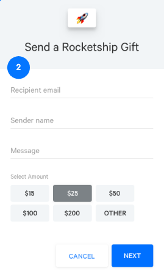

# Drop In Gift Cards
Lightrail's drop in gift card solution makes it easy to get up an running in days. 

The drop in solution is broken into 4 pieces:
- Gift card purchase
- Gift card redemption
- Account balance
- Checkout 

Lightrail has developed drop in widgets that can be used for all but the checkout step. 
Since the checkout process can involve both a credit card and a gift card, this step must be completed by updating your server side checkout code - don't worry, we have many libraries and examples to show you how this is done.   

## Configure your Drop In Gift Card Solution in Lightrail
Login to your Lightrail account and fill out the gift card template.
You'll also need to generate an API key which you'll use for server side calls from your application. 

## Widgets
Widgets are included on your pages. Widgets require a `shopperToken` to be able to make requests to Lightrail.

### Shopper Token
A `shopperToken` is generated server-side and can be thought of as a public API key that is unique to the shopper on your site.
You can generate the `shopperToken` by using one of our libraries. Below is an example of this is done.
```
\Lightrail\Lightrail::setApiKey ('<LightrailAPIKey>'); 
//your Lightrail API key. Find or create one using the Lightrail Web App after logging into your account.
\Lightrail\Lightrail::setClientSecret ('<LightrailAPISecret>'); 
//your Lightrail client secret. Find or create one using the Lightrail Web App after logging into your account.

$shopperId = 'alice'; //identify the logged-in customer.
$validityInSeconds = 5000;
$shopperToken = \Lightrail\LightrailClientTokenFactory::generate($shopperId, $validityInSeconds);
```



When you load a page that includes one of our widgets, you'll need pass the `shopperToken` to the page to be passed into the widget.

### Gift Card Purchase Widget
Below is the following snippet that powers the entire gift card sending flow. 
Note, it's up to you if you want to allow gift card sending from an unauthenticated page. 
While the shopper token is usually unique to an authenticated user, it can be created for an anonymous user to support anonymous gift card purchase. 
```html
<script src="path/to/widgets/cardPurchaseEmbed/index.js"
                    data-shopperToken="{{shopperToken}}">
</script>
```

### Gift Card Redemption Widget
The gift card email the recipient receives contains a link to apply the gift card to their account. 
You'll need to host the redemption page on your site, which includes the following redemption snippet.
Be sure to set your redemption page in your gift card template in Lightrail. 
The redemption page must be an authenticated page on your site. 
The `shopperToken` will belong to that authenticated user and will mean the gift card balance, when redeemed, is automatically applied to that user's Account in Lightrail.
```html
<script src="path/to/widgets/codeRedemptionEmbed/index.js"
                    data-shopperToken="{{shopperToken}}"
                    data-fullcode="{{fullcode}}">
</script>
```

### Account Balance Widget
This is a simple widget that allows for an authenticated user to view their account balance.
```html
<script src="path/to/widgets/accountBalanceEmbed/index.js"
                    data-shopperToken="{{shopperToken}}">
</script>
```

## Checkout
Checkout is broken into frontend and backend pieces.

### Frontend
The frontend logic is handled by a javascript which takes care of the following steps:

Making a balance-check call to obtain the available value of the current shopper's account credit.
Generating a tabular summary of the transaction breakdown, i.e. how much will be paid by the shopper's account credit and how much will be charged to their credit card. You can edit the javscript source to change the form or style of this table.
Loading the Stripe credit card form in case there is any remainder to be paid by a credit card.
Here is what the script parameters look like on your checkout webpage:

```html
<div id="ltrl-payment-summary" class="ltrl-container">
  <script src="js/lightrail-checkout.js"
            data-title="..."
            data-logo="..."
            data-total="..."
            data-currency="..."
            data-stripePK="..."
            data-shopperToken="..."
            data-checkout-endpoint="...">
  </script>
</div>
```
This script will mount the above elements in an html form. 
Once the customer approves the payment by pressing the Pay button, the form will get submitted to the backend endpoint specified by the 'data-checkout-endpoint' attribute.

### Backend
In order to finalize the checkout and charge the credit card and the Lightrail account, you need to have a method in your backend. If you already process Stripe payments, you are already familiar with this method as explained in Stripe's documentation.

Here is a sample of how posting the split-tender charge should look like in your backend method, using Lightrail integration libraries. Note that you can customize the names of the url-encoded form parameters in the front-end javascript.
```
\Lightrail\Lightrail::setApiKey('<LightrailAPIKey>'); //your Lightrail API key.
\Stripe\Stripe::setApiKey('<StripeApiKey>');

$orderTotal     = 37500; //order total from your store's order or cart object. 
$orderCurrency  ='USD';
$shopperId      = 'alice'; //identify the logged-in customer

$token          = $_POST['source']; //Stripe token
$lightrailShare = intval( $_POST['lightrail-amount'] ); //the breakdown of the split-tender as approved by the cusomer on the checkout page and passed in the form parameters.

$stripeShare    = $orderTotal - $lightrailShare;

$param = array(
	'amount'    => $orderTotal,
	'currency'  => $orderCurrency,
	'source'    => $token,
	'shopperId' => $shopperId
);

$splitTenderCharge = \Lightrail\StripeLightrailSplitTenderCharge::create(
	$param,
	$lightrailShare);

//post-checkout logic.
```

The StripeLightrailSplitTenderCharge class, which has a similar interface to Stripe's Chargeclass enables you to create a split-tender transaction between Lightrail and Stripe by specifying the parameters and the transaction breakdown. It will ensure that either both portions of the transactions will be successful or none of them will be posted. In cases where either Stripe or Lightrail share is set zero, this class will simply create the respective transaction.

