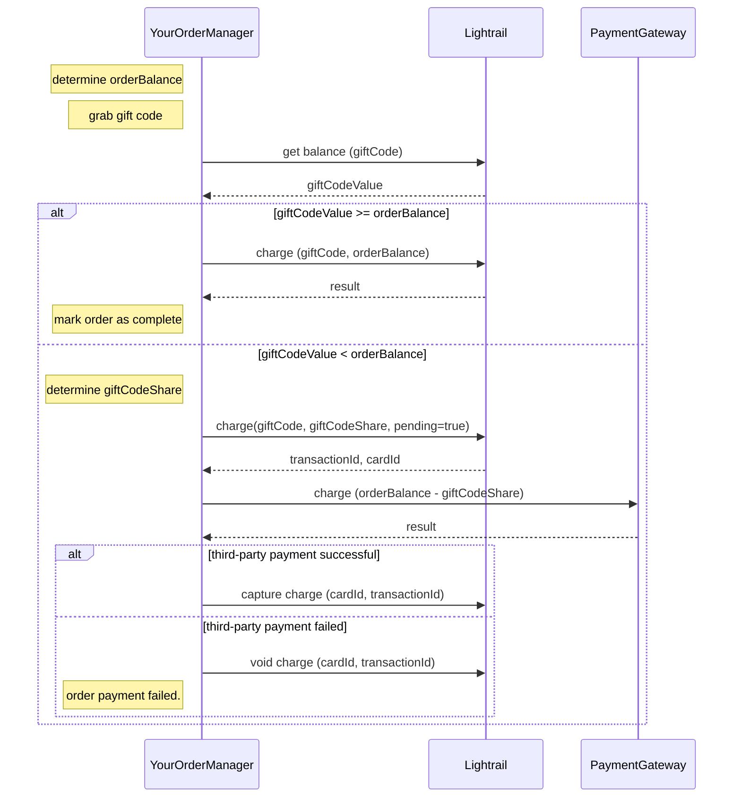

```mermaid
sequenceDiagram
participant YourOrderManager
note left of YourOrderManager: determine orderBalance
note left of YourOrderManager: grab gift code
YourOrderManager->>Lightrail:get balance (giftCode)
Lightrail-->>YourOrderManager:giftCodeValue
alt giftCodeValue >= orderBalance
YourOrderManager->>Lightrail: charge (giftCode, orderBalance)
Lightrail-->>YourOrderManager: result
note left of YourOrderManager: mark order as complete
else giftCodeValue < orderBalance
note left of YourOrderManager: determine giftCodeShare
YourOrderManager->>Lightrail: charge(giftCode, giftCodeShare, pending=true)
Lightrail-->> YourOrderManager :transactionId, cardId 
YourOrderManager->>PaymentGateway: charge (orderBalance - giftCodeShare)
PaymentGateway-->>YourOrderManager: result
alt third-party payment successful
YourOrderManager->>Lightrail: capture charge (cardId, transactionId)
else third-party payment failed
YourOrderManager->>Lightrail: void charge (cardId, transactionId)
note left of YourOrderManager: order payment failed.
end
end
```

